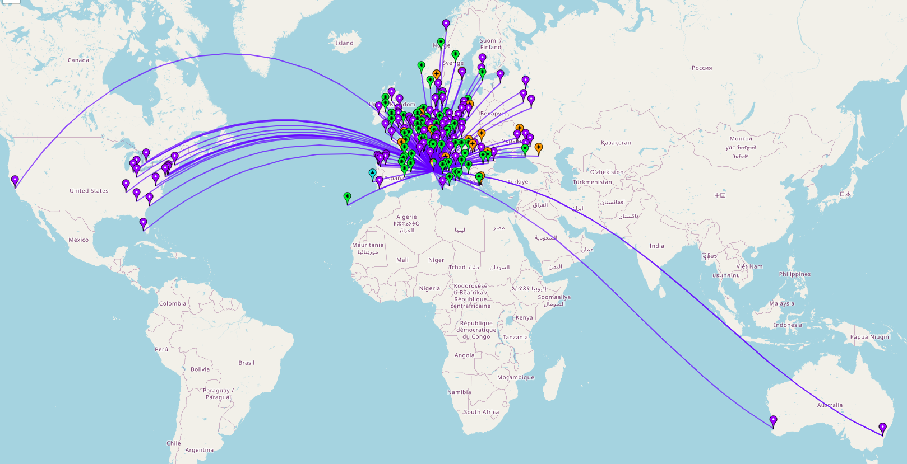

+++
title = 'Vacation in Corsica with amateur radio'
date = 2025-08-11T17:40:44+02:00
draft = false
tags = ['qrp', 'qmx']
featured = "featured.jpg"
+++

This summer we spent 14 days on the island of Corsica. It was first and foremost a family vacation — beaches, swimming in the turquoise sea, exploring villages, and enjoying Corsican food and atmosphere.
Still, I wanted to bring some radio gear and test a few antennas. This wasn’t a dedicated “ham trip,” but I figured that early mornings and the occasional evening could be good windows for making some QSOs.

_Corsica!_

# Preparation

When planning to operate from abroad, the first step is checking the legal requirements. The French amateur radio association, Réseau des Émetteurs Français (REF), has [a helpful page](https://web.r-e-f.org/operating-in-france/) explaining how to operate in France and under what license conditions. From the REF site and the CEPT documentation, I confirmed my callsign would be **TK/LB2KK** when operating from Corsica. I also printed my Norwegian license and CEPT documents, just in case I had to prove operating rights to anyone.

{style="width:50%"}
_CEPT license._

Next I wanted to log my QSOs the same way as I do at home with **Logbook of the World (LoTW)** and **QRZ.com**. The short version is that I use **QLog** to manage my log on my laptop and then I sign and upload the log entries to LoTW. On QRZ.com I import the log entries from LoTW. The main callsign certificate is of course using my licensed callsign in Norway (LB2KK), and it would be wrong or at least misleading to sign the QSOs made from Corsica with that certificate. But this was easy to solve in TQSL, where additional callsign certificates can be requested (see [this guide](https://g1ybb.uk/portable-and-alternate-callsigns-on-lotw/) for details). On QRZ.com I also created a new logbook for TK/LB2KK so that the logs from Corsica are separate.
All the software being used (FT8CN, WSJT-X, etc.) also needed to be configured with the new callsign.

# Equipment

What equipment to bring? Well, as I stated above, this was first and foremost a family vacation, so there was no opportunity to bring a lot of gear. I landed on the following list:

* [QMX 5 W transceiver from QRP Labs](https://qrp-labs.com/qmx.html). Powered with a regular USB power bank and a 12 V USB-C trigger cable that fits the barrel input connector on the QMX.
* [SotaBeams Tactical Mini](https://www.sotabeams.co.uk/tactical-mini-compact-ultra-portable-6-m-19-6-ft-mast/) — a compact 6 m mast that fits nicely in my main bag.
* A 2.7 m [telescopic fishing pole](https://s.click.aliexpress.com/e/_onwfvrj) (affiliate link).
* [Kanga Pocket Transmatch](https://www.kanga-products.co.uk/ourshop/prod_7635987-QRP-Pocket-Transmatch.html).
* Various wire antennas (linked end-fed, dipole) and antenna couplers. Also a couple of meters of spare wire and cord.
* 3D-printed [paddle](https://www.printables.com/model/653813-iambic-cw-morse-code-paddle-by-km4cft) and [microphone](https://www.printables.com/model/320559-mini-microphone-for-qmx-trusdx-usdx-kx2-and-kx3).
* NanoVNA to measure SWR.
* Laptop with wsjt-x installed, and Android smartphone with [FT8CN](https://github.com/N0BOY/FT8CN).
* Connectors, extra line, chokes, wire cutter, small multimeter, etc.

_QMX radio, powerbank, microphone and laptop - ready to operate._

The laptop, QMX radio, USB power bank, as well as the NanoVNA (which has an internal battery) were packed in the carry-on. The rest went in the checked-in baggage. The important thing is not to have any batteries in the checked-in baggage. My USB power bank has a capacity of 10 000 mAh / 37 Wh and is, at the time of writing, allowed in carry-on. It charges with the same USB-C charger as my smartphone, so no special charger was needed.
There were no questions from airport security about this equipment, but I still carried a printed copy of my amateur radio license just in case.

**Tip:** do a small test session with the exact gear you plan to bring, so you don’t forget anything. There’s nothing as frustrating as reaching your destination and realizing a cable or adapter is missing.

# Antennas

Deploying antennas during a family holiday is a balancing act. We stayed in four Airbnbs and I managed to operate from three of them. I considered asking the hosts for permission, but since my setups were temporary and unobtrusive — and given the language barrier — I just kept them low-profile.
Typical operating time was 1–2 hours, after which I took everything down. The last place we stayed was rural and private, so I could put up the full 6 m mast. In tighter spaces, the 3 m fishing pole worked well.

Practical note: secure wires to avoid trip hazards and place antennas a safe distance from people. QRP levels are low, but better safe than sorry.

I used three antennas:

* Linked end-fed for 40 m, 20 m, and 10 m (from the book [Hand-carried QRP antennas](https://books.vk3ye.com/handqrp.htm) by VK3YE). Built with [mini-banana plugs](https://s.click.aliexpress.com/e/_oEqbvaZ) (affiliate link) and a 2 m counterpoise. Requires tuner.
* EFHW multiband cut for 40 m, with harmonic coverage for 20 m, 15 m, and 10 m. Built with a combined 56:1 auto-transformer and choke. No tuner needed.
* 20 m dipole (unfinished linked dipole project) — single band but surprisingly effective for DX.

_Linked end-fed antenna with mini banana plugs._

They were deployed in various arrangements:

* In **Calvi**, the linked end-fed was run along the balcony railing and sloped up to a 6 m mast, or the shorter 3 m fishing pole.
* In **Erbalunga**, the EFHW was raised on a fishing pole from a balcony and then sloped partly back into the apartment, as space was limited.
* In **Albitreccia**, I had enough room to raise the EFHW from the mast, sloping down towards a small table. Here I also deployed the 20 m dipole as an inverted-V with the 6 m mast.

{style="width:60%"}

_Sloped EFWH antenna in Albitreccia._

The QMX has built-in SWR tuning, but I used the NanoVNA to check SWR and adjust antenna and counterpoise placement. In hindsight, I should have spent more time tuning the antennas before leaving. My quick method is simply folding back the wire of the EFHW or dipole to fine-tune the length.

# Operating results

I mostly ran FT8 and FT4, logging **208 QSOs** in total with 5 W from the QMX. The radio recently gained SSB capability via firmware update, and while 5 W SSB isn’t easy, I did manage one voice QSO.
Best DX for digital mode: **Australia on 20 m** early one morning, plus several contacts into the USA. Most European bands were busy, with 20 m giving the widest reach. I’m still learning CW and didn’t try it this time — sending “TK/LB2KK” felt too difficult for me.

Here is a summary of QSOs per band:

| Band | Count | Percent |
|------|-------|---------|
| 40m  | 73    | 35.10%  |
| 30m  | 16    | 7.69%   |
| 20m  | 118   | 56.73%  |
| 15m  | 1     | 0.48%   |

It’s difficult to say which antenna worked best, since results depend heavily on setup and local conditions, but I was impressed by the EFHW, which gave frequent QSOs. With the dipole I logged more contacts outside of Europe. And again, I was very happy I brought the NanoVNA — it really shows what difference a missing counterpoise makes.
I’m not sure if Corsica is considered a popular DXCC entity, but operators kept calling me on FT8 even without me CQing first.

| Date  | Place       | QSOs | Antenna        |
|-------|-------------|------|----------------|
| 31.07 | Calvi       | 4    | Linked end-fed |
| 01.08 | Calvi       | 5    | Linked end-fed |
| 02.08 | Calvi       | 5    | Linked end-fed |
| 03.08 | Calvi       | 10   | EFHW           |
| 04.08 | Erbalunga   | 12   | EFHW           |
| 08.08 | Albitreccia | 21   | EFHW           |
| 09.08 | Albitreccia | 37   | EFHW           |
| 10.08 | Albitreccia | 93   | EFHW/Dipole    |
| 11.08 | Albitreccia | 21   | Dipole         |

_Map of QSOs made from Corsica._

# Final thoughts

All in all it was a very nice experience bringing radio gear to Corsica. For these kinds of family vacations it is important not to overdo it. Clarifying with other family members in advance helps ensure it doesn’t conflict too much with normal vacation activities. Not everyone likes antennas in front of a sea view.
I would have liked to try operating from the beach to take advantage of saltwater, but that is probably best done off-season. I also considered a POTA activation, but it was simply too hot and didn’t quite fit the vacation plan.

**Tips for bringing the radio on vacation:**

* Clarify your planned radio activities with family members so there are no surprises.
* Test gear before you go — especially tuner, power source, and antenna combinations.
* Bring as little gear as possible.
* Consider 2m / 70 cm gear — I learned only after arriving that [Corsica has several repeaters](https://www.radioamateur.tk/index.php/en/).
* The **QMX** is excellent for travel — small, light, USB-powered (via 12 V trigger cable), and easy to pair with a power bank.
* **EFHW antennas** are very versatile for portable ops, but a well-tuned dipole is excellent for DX.
* A **NanoVNA** is worth bringing along — quick diagnostics can save operating time.
* Early morning sessions are great for DX and don’t cut into family activities.
* A couple of extra guy lines or clips make setting up in unknown locations much easier.
* Most importantly — **have fun!**
