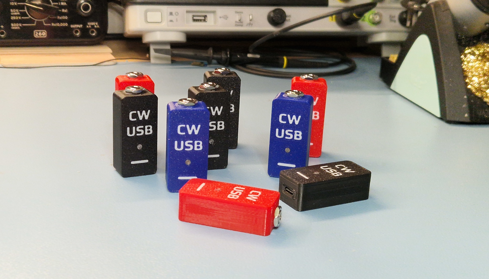
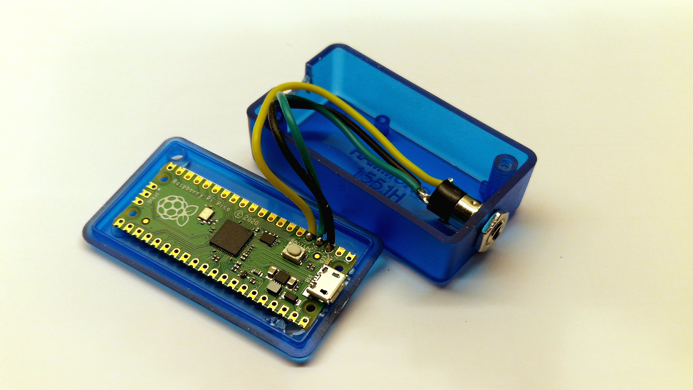
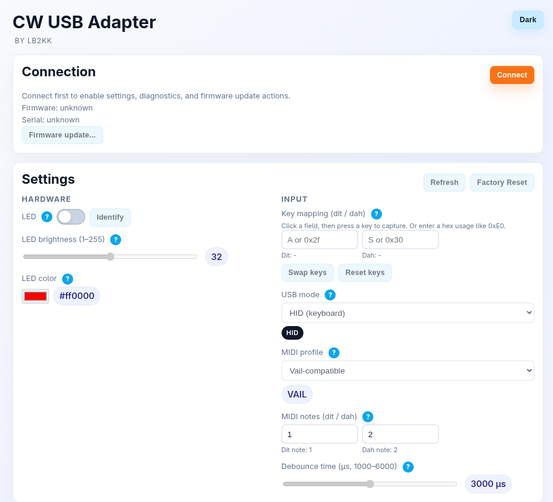
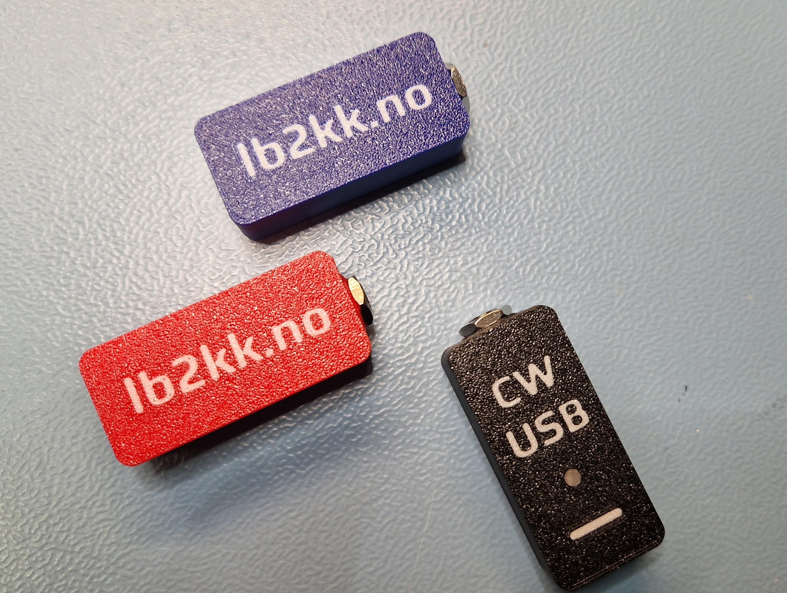

+++
title = 'CW USB adapter'
date = 2026-02-20T22:41:57+01:00
draft = false
summary = "Introducing the CW USB adapter!"
tags = ['cw', 'cw usb adapter']
+++

# CW USB adapter for practicing CW online

_The first batch of CW USB adapters._

For the last year or so, I have been trying to learn CW, also known as Morse code. Why, you might ask? It is no longer a requirement for the license, and it is not used professionally anymore either. First of all, I like a challenge, but CW is also a very efficient mode: the energy sent from the radio only occupies about 100 Hz. This is a good fit for lightweight POTA activations, but also if you live in a city with a lot of background noise (like me) or with a compromised antenna setup (yes, I have that as well).

I have found many great resources around the web that make learning fun. You have sites like [LCWO](https://lcwo.net), which offers a complete course, and [Morse Code World](https://morsecode.world/international/keyer.html), with a wealth of tools. Then I discovered that you can play games like [Morse Invaders](https://morseinvaders.com) and [Morse Code Battleship](https://tools.hamradioduo.com/morse-battleship/) with a CW paddle connected to your computer. You can even have online QSOs directly in the browser with [Virtual CW Band (VBand)](https://hamradio.solutions/vband) or [Vail Morse](https://vailmorse.com).

But to use these sites, I needed a way to connect my paddle to the computer. For this, I built a small adapter using the [Raspberry Pico](https://www.raspberrypi.com/products/raspberry-pi-pico/) board. The concept is simple: the board emulates a USB keyboard, but with only two keys, one for dit and one for dah. This works great across Windows, macOS, and Linux.

_The prototype with micro USB._

Then, at some point, someone showed me vailmorse.com, which uses [MIDI](https://no.wikipedia.org/wiki/MIDI), originally developed as a way to interface musical instruments with computers. Using MIDI has a couple of advantages over the keyboard approach described above. First, an application usually must have focus to receive keyboard input, but this is not the case with MIDI. Second, you avoid problems with features like sticky keys, privacy settings, or other settings that might interfere with how key presses are handled by the operating system.

## Configuration

The adapter sends Ctrl Left and Ctrl Right keys by default and switches automatically to MIDI on web pages like https://vailmorse.com. You can change settings like key mapping at https://lb2kk.no/cwusb/. That page uses the [Web Serial](https://developer.mozilla.org/en-US/docs/Web/API/Web_Serial_API) API in the browser to establish a serial connection to the CW USB adapter. It works in most Chromium-based browsers (Vivaldi, Edge, Chrome), and probably others.

_Configuration page available at https://lb2kk.no/cwusb._
{style="width:70%"}

## Summary

I made ten of these adapters for the annual [ham meeting](https://www.hammeeting.no/) here in Norway, and they turned out to be popular. I sold nine of them on the first evening :-) There were many interesting questions and discussions. One buyer wanted to use it with Morse Mania on his iPhone (that worked fine after reconfiguring it slightly), and another wanted to use it with Flex and SmartSDR (still working on that, but it should not be too difficult). All in all, a fun project.

I do not have any ready-made CW USB adapters right now, but send me a line at info@lb2kk.no if you are interested in having one yourself.

_CW USB adapter with USB-C._
{style="width:50%"}

