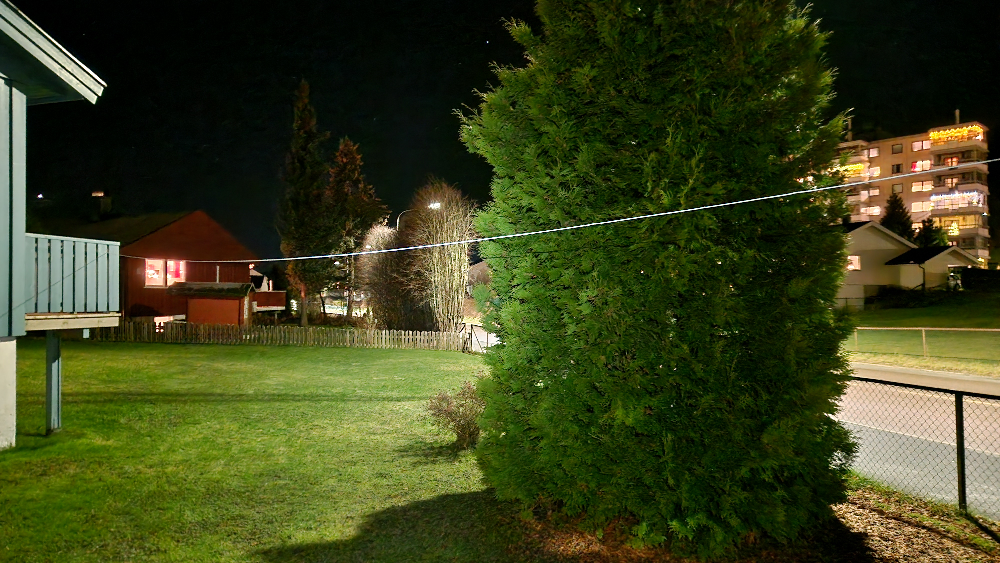
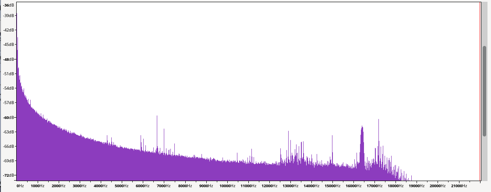

+++
title = 'First attempt listening to SAQ Grimeton'
date = 2024-12-25T14:29:26+01:00
draft = false
summary = "First attempt at listening to SAQ transmission from Grimeton radio station."
tags = ['vlf', 'saq']
+++

# SAQ 2024

Via a local newsletter, I was made aware of the yearly [Christmas transmission](https://alexander.n.se/en/saq-to-air-on-christmas-eve-morning-dec-24th-2024/) from Grimeton radio station in Sweden:

> On Christmas Eve morning, Tuesday December 24th 2024, SAQ Grimeton is scheduled to be on the air, to send out the traditional Christmas message to the whole World, using the 200kW Alexanderson alternator from 1924, on 17.2 kHz CW.

The radio station is fascinating in itself, and I encourage you to go and read more about it on its home page. I didn't have too much time to prepare for the event, but the home page describes a method of using some long wires connected directly to the sound card of a laptop. So I bought some cheap speaker wire and a [3.5 mm TRRS terminal block](https://www.kjell.com/no/produkter/kabler-og-kontakter/kabler-for-lyd/35-mm/35-mm-kontakter/terminalblokk-35-mm-hann-stereo-p69025). According to [Wikipedia](https://en.wikipedia.org/wiki/Phone_connector_(audio)#TRRS_standards) the de facto standard for 3.5 mm TRRS is called CTIA/AHJ, and the wiring is as follows:
* Tip is for left audio channel.
* Ring 1 is for right audio channel.
* Ring 2 is for ground.
* The sleeve is for the microphone.

The wire was mounted between a tree and a balcony around 2 meters above ground, as seen in the picture below. A cable of the same length for the ground was connected to ring 2 (in hindsight, I should maybe have grounded it directly to earth).

_Wire between a tree and balcony._

I used Audacity for the recording, but as you can see in the spectrogram, I couldn't decode any CW. There is a spike around 17.2 kHz, but the amplitude is around -60 dB relative to the strongest signal. Anyway, I sent in a report using their online QSL form.

## For next time

After the event, I found many interesting pages describing other ways of receiving the signal:
* Using a tuned ferrite rod: https://www.prinz.nl/SAQ.html, https://www.avalonarc.org.uk/2022/06-30-listening-for-saq.html and https://www.avalonarc.org.uk/2023/07-02-saq-alexanderson-day.html
* Sound card-based receiver (SAQrx): https://dl1dbc.net/SAQ/
* Vlfrx-tools: https://klubnl.pl/wpr/en/index.php/artykuly/uzywanie-vlfrx-tools/
* Using Airspy and home-made active antenna (Mini-Whip): https://www.youtube.com/watch?v=Ji_YOyFjLwc

I also learned that there is a [VLF transmitter in Norway with call sign JXN](https://en.wikipedia.org/wiki/Noviken_VLF_Transmitter) used to send message to submarines on 16.4 kHz.

There are many options to explore here, and I will see if I can use some of them to receive the signal the next time Grimeton starts the engines.
