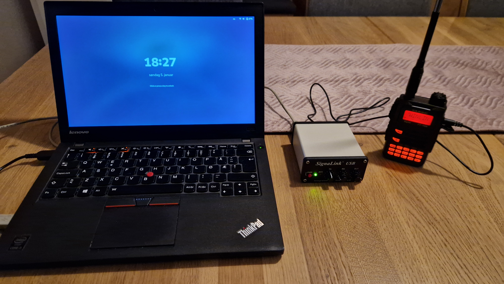
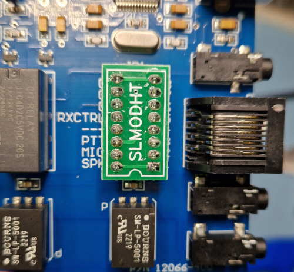
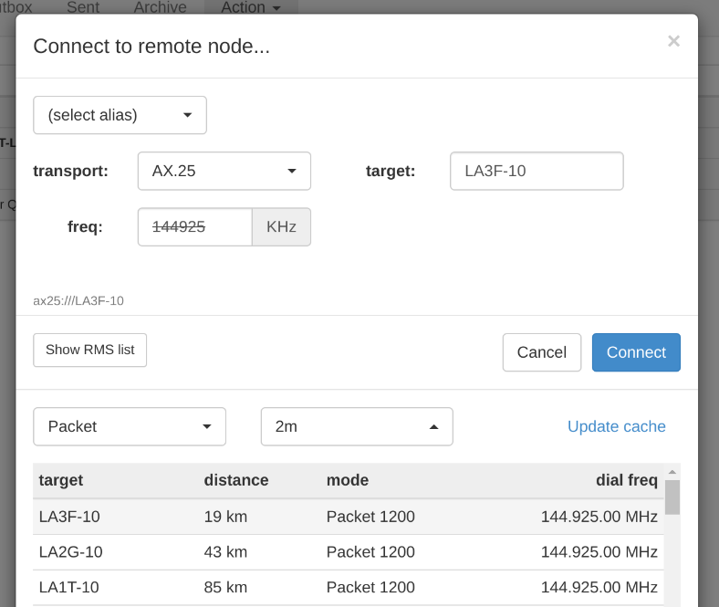
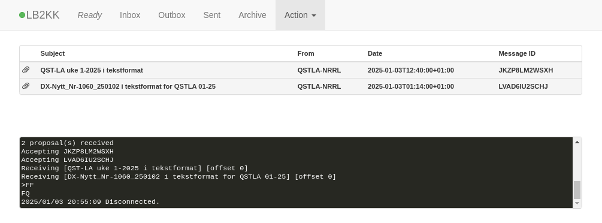
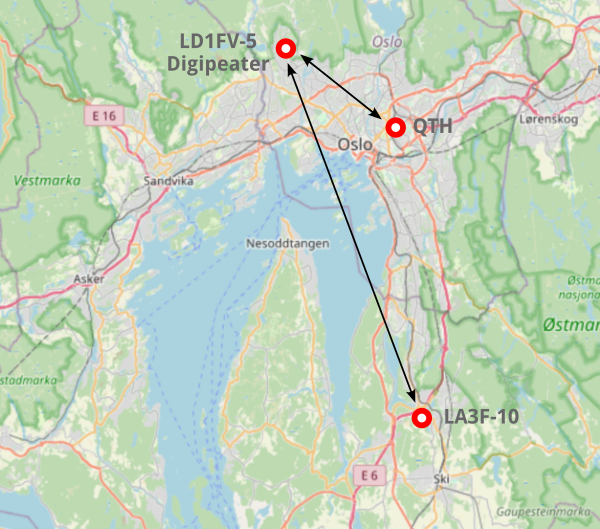

+++
title = 'Winlink, Pat and Yaesu FT-70D'
date = 2025-01-03T23:18:50+01:00
draft = false
summary = "Read more about how I finally managed to send and read emails using a VHF radio with Winlink."
tags = ['winlink', 'pat', 'dire wolf', 'ax.25', 'SignaLink']
+++

# Winlink with Pat and Yaesu FT-70D



_Laptop, SignaLink USB, and Yaesu FT-70D._

As a newly licensed radio amateur, I have a limited number of radios — or only one that can transmit: the VHF/UHF [Yaesu FT-70DE](https://www.yaesu.com/indexVS.cfm?cmd=DisplayProducts&ProdCatID=111&encProdID=7CDB93B02164B1FB036530FBD7D37F1A&DivisionID=65&isArchived=0). I have spent some weeks with the radio now, learning how to operate it, adding repeaters, and exploring the settings. But what else can I use a handheld VHF/UHF radio for? It turns out that I can use it to send and receive emails using what is known as [Winlink](https://en.wikipedia.org/wiki/Winlink).

But then again, why would anyone send an email over a radio link like this? And yes, it's not something you use every day, but for remote locations far away from the modern infrastructure, it makes more sense. One interesting event was when [Winlink was used to restore communication to the Norwegian meteorological stations Hopen and Bjørnøya](https://nrrl.no/nyheter/nrrls-assistanse-til-meteorologisk-institutts-stasjoner-pa-ishavet/) at the beginning of 2022. A cyberattack caused malicious firmware to be uploaded to the Iridium modems thereby interrupting the main communication channel. To me, the ability to communicate without any dependencies on the internet, mobile, or satellite operators is one of the things that fascinates me about amateur radio.

## Short about the Winlink architecture

I'm probably not the best to give a full overview of the Winlink system, but I will summarize how I understand it. The [Winlink presentation from K0SWE](https://www.rmham.org/wp-content/uploads/2022/03/RMHAM-U_-Data-Transmission-Protocols-and-Pat.pdf) gives a very nice introduction.

* Winlink is a network that can send and receive emails/messages using radios.
* A radio node connected to the internet is called RMS (Radio Message Server). These can relay emails further onto servers known as CMS (Central Messaging Server).
* It is also possible to send emails directly between two radios (peer-to-peer or radio-only mode) with no internet connectivity at all. An overview of RMS nodes can be seen here: https://www.winlink.org/RMSChannels
* Various applications can be used for Winlink, but the de facto software seems to be [Winlink Express](https://winlink.org/WinlinkExpress). I have used the [Pat Winlink client](https://getpat.io) since it is cross-platform, open source, and runs on Linux.
* The application layer protocol is called [_B2F_](https://winlink.org/B2F).
* A message can be relayed between many nodes. The link layer protocols can vary between the different hops. This is where terms such as _AX.25_, _Packet 1200_, _VARA FM_, etc. come in. These are protocols that again use various modulations.

## My setup

Setting up the hardware wasn't too difficult, but I needed a way to connect my laptop to the radio. The Yaesu FT-70D has a USB port for programming and firmware updates. The USB port can't be used for any control as far as I know. But like most VHF radios, it also has a 3.5 mm TRRS socket to connect an external microphone and headset. To connect the audio in/out to the laptop, I bought a [SignaLink USB](https://tigertronics.com/slusbmain.htm) from Tigertroncis. This is a USB sound card with additional circuitry. It has a VOX (voice-operated exchange) that will engage PTT when audio is received from the laptop. With SignaLink it is important to buy a cable and SignaLink module that matches your radio. The module is easy to install as seen in the image below. With the modular setup of the SignaLink, I can reuse it for other experiments later.



_The module installed in SignaLink USB._

## Software and configuration

As mentioned, I installed the [Pat Winlink client](https://getpat.io) and followed the [documentation](https://github.com/la5nta/pat/wiki) to configure it. This also involves registering on [winlink.org](https://winlink.org) to get an account and set a password.

The [second link with instructions](https://github.com/la5nta/pat/wiki/AX.25-with-Direwolf), was how to configure Pat to use [Dire Wolf](https://github.com/wb2osz/direwolf). To quote from the Pat documentation:
> "Dire Wolf is a cross-platform sound card modem for packet radio (AX.25)".

There is another option to use AX.25 directly from the Linux kernel, but again from the Pat documentation:
> "The recommended method of connecting Pat with Dire Wolf is through it's AGWPE interface. The ax25+agwpe transport supports both outbound and inbound connections."

In Fedora, I installed Dire Wolf with the command `sudo dnf install direwolf`. Dire Wolf uses a configuration file (_direwolf.conf_) and the only change I made there, was to set the correct USB device for the SignaLink USB sound card:

```
# Linux ALSA is complicated.  See User Guide for discussion.
# To use something other than the default, generally use plughw
# and a card number reported by "arecord -l" command.  Example:

ADEVICE hw:2,0
```

One potential problem when running Dire Wolf is access permissions to the sound card device. Often, this can be solved by ensuring that your Linux user is a member of the group `dialout`. Running Dire Wolf as root is a last resort and not recommended.

At a high level, I guess one could say that Pat takes care of the Winlink protocols and communicates to Dire Wolf via _AGWPE_. Dire Wolf takes care of encoding and decoding _AX.25_ and uses the SignaLink USB sound card.

## Audio and volume controls

One important aspect of this setup is to get the audio levels set correctly in both the laptop and the radio.

Starting with the radio, I configured it as follows:
* Turn off the squelch.
* Set the volume to 15 which is about the middle of the scale.

For the laptop, I used the program `pavucontrol` which shows all the sound card interfaces. In this program, the SignaLink USB shows as _PCM2906C Audio CODEC_. I configured the levels as  follows:
* Input Devices: 100%
* Output Devices: 50%

Also, I mute the built-in sound card just to make sure that no other sounds (like mail notifications) affect the setup. Dire Wolf seems to take full control over the sound card. So, when Dire Wolf runs, it is not possible to, for example, use `pavucontrol` to see the audio levels.


## Unsuccessful first tests

When I had configured all of this, I of course, wanted to test sending and receiving emails via Winlink. The most up-to-date overview of Winlink in Norway is from [LA3F](https://la3f.no/index.php/faste-installasjoner/winlink). From this overview, I picked LA3F-10 as it is closest to QTH. It uses _Packet 1200_ and _144.025 MHz_ as frequency.

Pat can be used from the command line or via a UI in the web browser. I found the UI to be easy to use. For this to work, Pat has to be started with the parameter `http` like this:

```
pat http
2025/01/18 10:03:55 Starting HTTP service (http://localhost:8080)...
```

Then visit [http://localhost:8080](http://localhost:8080) to see the UI.

The connection dialog in Pat is as seen below. It includes a very convenient feature that shows all nearby RMS nodes. I tested with the target set to `LA3F-10`. I could hear the relays in the SignaLink USB clicking and the radio transmitting, so the setup seemed to work as expected. But sadly, no successful connections were made. I moved around my home and tried from the attic and various places, but with no success. Probably, I was too far away from `LA3F-10`.



_The Pat connection dialog._

The overview page from [LA3F](https://la3f.no/index.php/faste-installasjoner/winlink) also mentions a Winlink digipeater (LA3F-10 via LD1FV/LD1FV-5) at Voksenkollen, Oslo.  This is a lot closer to my QTH compared to `LA3F-10`. As the name implies, a digipeater repeats digital signals at the same frequency as it was received. I tried with both `LD1FV` and `LD1FV-5` as targets, but still, no successful Winlink connection was made.

What could be wrong? After a lot of googling, I came across a [post](https://groups.io/g/KM4ACK-Pi/topic/using_pat_winlink_with/77965522) to a mailing list asking exactly what I was looking for:

>I live in an area that uses digipeaters to connect Winlink Gateways.
>How do I use PAT to connect to these gateways?
>
>Robert

And then in the answer:

> On the connect screen choose AX25 as your transport. Then in the target box enter the digi first and the gateway second separating them with a "/"
>...
>73, de KM4ACK

Eureka! It turns out that the digipeater needs to know the next node to connect to. I entered the target `LD1FV-5/LA3F-10` in the Pat connecting screen, clicked _Connect_ and it worked!




_Emails received in Pat._

## Conclusion

This was a fun learning experience. I'm probably not going to use Winlink a lot, but I know a bit more about how it works and the possibilities it offers. In Norway, it is mostly mountain areas that are without mobile network coverage. I guess most people would use satellite services like Iridium and Starlink in those situations. But radio amateurs have this possibility as well. And it is free to use.

Lastly, here is a map showing how I picture the connectivity from my QTH via the digipeater to the RMS node, which again connects to the Internet.



_A screenshot from [OpenStreetMap](https://www.openstreetmap.org/copyright) showing my QTH, the digipeater, and the RMS node._


