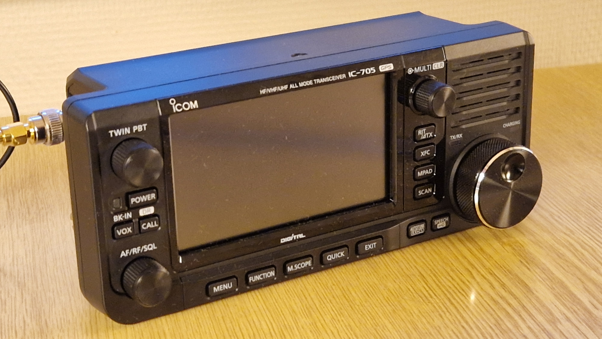
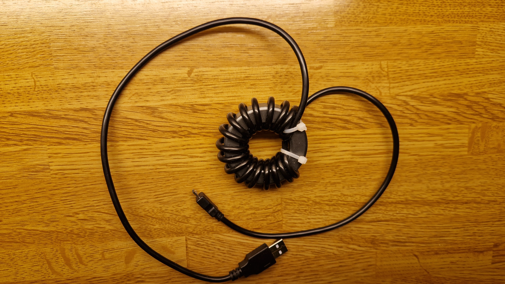
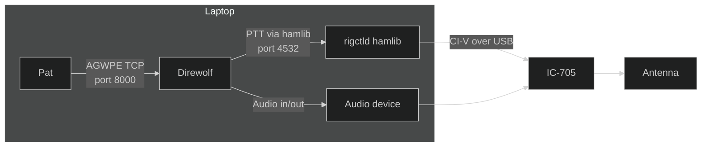

+++
title = 'Using the Pat Winlink Client with IC-705'
date = 2025-04-19T23:10:25+02:00
draft = false
summary = "A guide to operate Winlink via Pat, Direwolf, and rigctld using the ICOM IC-705 on Linux, including tips for avoiding USB interference."
tags = ['winlink', 'pat', 'dire wolf', 'ax.25', 'ic-705']
+++





During Easter 2025 I took part in a Winlink exercise for Norwegian radio amateurs. In my [last write-up about Winlink](/posts/winlink), I used the Yaesu 70D. Since then I have bought an ICOM IC-705 and that is the radio I have used for this exercise.

As of April 2025, the latest Pat Winlink Client is version 0.16.0, but in order to complete all tasks I had to use the _develop_ branch from the GitHub repo since it has support for text forms.

## Hardware and software setup

My setup is as follows:
* Lenovo Thinkpad X250 laptop running Fedora Linux 41.
* ICOM IC-705 connected to the laptop with a USB cable.
* I used a Diamond SRH 771 for 144/430 MHz antenna directly mounted to IC-705 via RC-2 BNC adapter.

The quality and shielding of the USB cable is of great importance in this setup. I had severe problems with this, and experienced that the USB connection dropped when the IC-705 started transmitting. In the kernel logs (_dmesg_) I could see messages like this:

```console
usb usb2-port1: disabled by hub (EMI?), re-enabling...` or `usb 1-1-port2: Cannot enable. Maybe the USB cable is bad?
```

I bought a brand new USB cable and ferrite clamps which made it more stable, but what really worked was to lower the RF output power of the IC-705 to 10% (0.5 W). So this clearly shows that RF couples into the USB cable and messes up the USB interface on the laptop. After that I found an even better solution in the video ["Let's remove USB noise from our IC-705" by Temporarily Offline](https://www.youtube.com/watch?v=gwdEZlHSmjg) that uses a FT-240-43 toroid with the USB cable wound around the toroid as many times as you can fit.



Also, see this nice article about [how to identify bad USB cables](
https://kb.atomminer.com/kb/bad-usb-cables-how-to-identify-them/).

For the software I use rigctld, Direwolf and Pat Winlink Client.


_Block diagram of how this is connected._

### rigctld

Rigctld allows the other the two other applications (Direwolf and Pat) to control the IC-705. It starts a server that listens on port 4532 for connections.

This allows Pat to set frequency, and Direwolf to engage the PTT button.

I start Rigctld like this in a separate terminal:
```rigctld -m 3085 -r /dev/ttyACM0 -s 19200```

The options are as follows:
* `-m 3085` the radio model number. 3085 is the model number for ICOM IC-705.
* `-r /dev/ttyACM0` the name of USB port connected to the radio.

Finding out the USB port names can be a challenge, but I usually check which devices I see starting with `/dev/tty*` before and after plugging in the USB cable.

Even nicer is to configure custom udev rules as [described in this article](https://www.florian-wolters.de/posts/ic705-serial-device-symlinks/). Then the two interfaces of ICOM-705 appears as `/dev/ic-705a` and `/dev/ic-705b`.

### Direwolf

Not that much to say about Direwolf, except that I have configured it to use the Rigctld port 4532 for PTT:

```PTT RIG 2 localhost:4532```

Note that the model number must be `2` for use with Rigctld as it uses Hamlibs generic TCP backend. I tried with `3085` (the model number for IC-705), but that doesn't work.

Here is the configuration for Direwolf (I have removed all comments):
```
ADEVICE plughw:2,0
CHANNEL 0
MYCALL LB2KK
MODEM 1200
PTT RIG 2 localhost:4532
AGWPORT 8000
KISSPORT 8001
IGTXLIMIT 6 10
```

Also, note that Direwolf listens on port 8000 for AGW. This is again used from Pat. From the Direwolf User Guide:

```Dire Wolf provides a server function with the “AGW TCPIP Socket Interface” on default port 8000```

### Pat Winlink Client

Pat has to be configured to use both Direwolf and to connect to port 4532 where Rigctld is running.

The `hamlib_rigs` section configures a rig within Pat. In my configuration I have created a "ic_705" rig that again just points to Rigctld. Then the rig can be used in other parts of the config as in the `ax25` section.

Also, notice the `agwpe` section that refers to the AGW TCPIP Socket Interface on port 8000 from Direwolf.

```json
  "hamlib_rigs": {
    "ic_705": {"address": "localhost:4532", "network": "tcp"}
  },
  "ax25": {
    "engine": "agwpe",
    "beacon": {"every": 3600, "message": "Winlink P2P", "destination": "IDENT"},
    "rig": "ic_705",
    "ptt_ctrl": false
  },
  "ax25_linux": {
    "port": "wl2k"
  },
  "agwpe": {
    "addr": "localhost:8000",
    "radio_port": 0
  },
```

## Script to start all software

As you see from above, there are three components that needs to be started. Instead of starting each of them in a separate terminal window, I asked ChatGPT about a script to handle this. I also configured the [udev rules](https://www.florian-wolters.de/posts/ic705-serial-device-symlinks/). This is what it came up with it:

```bash
#!/bin/bash

RIG_DEV="/dev/ic-705a"
pids=()  # Store child PIDs
procs=() # Store names for debugging (optional)

# Cleanup function for Ctrl-C
cleanup() {
    echo -e "\nCaught Ctrl-C, stopping processes..."
    for pid in "${pids[@]}"; do
        if kill -0 "$pid" 2>/dev/null; then
            echo "Killing PID $pid"
            kill "$pid"
        fi
    done
    wait
    echo "All processes stopped."
    exit 0
}

# Trap Ctrl-C
trap cleanup SIGINT

# Check for rig device
if [ ! -e "$RIG_DEV" ]; then
    echo "Error: $RIG_DEV not found!"
    exit 1
fi

# Start rigctld (silent)
echo "Starting rigctld on $RIG_DEV..."
rigctld -m 3085 -r "$RIG_DEV" > /dev/null 2>&1 &
pids+=($!)
procs+=("rigctld")

sleep 2

# Start direwolf and prefix output
echo "Starting direwolf..."
direwolf 2>&1 | while IFS= read -r line; do echo "D: $line"; done &
pids+=($!)
procs+=("direwolf")

# Start pat and prefix output
echo "Starting pat http..."
~/Code/pat/pat http 2>&1 | while IFS= read -r line; do echo "P: $line"; done &
pids+=($!)
procs+=("pat")

# Wait for background processes
wait
```

